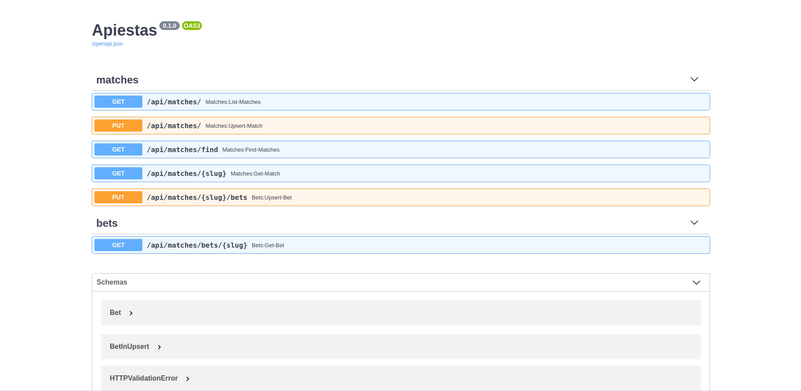
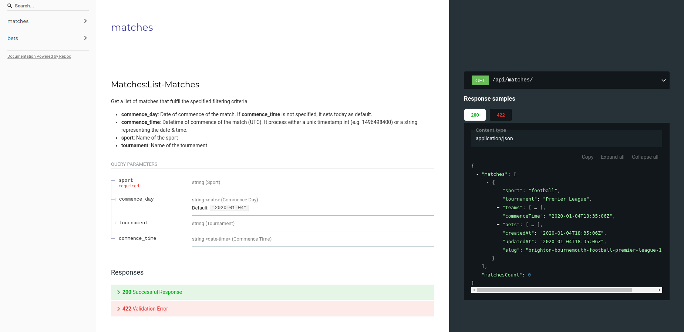

|

.. image:: https://img.shields.io/github/license/Naereen/StrapDown.js.svg
   :target: https://github.com/franloza/apiestas/blob/master/LICENSE

.. image:: https://circleci.com/gh/franloza/apiestas/tree/master.svg?style=shield
    :target: https://circleci.com/gh/franloza/apiestas/tree/master

Introduction
------------
Apiestas is a project composed of a backend powered by the awesome framework `FastAPI
<https://github.com/tiangolo/fastapi/>`_ and a crawler powered by `Scrapy
<https://github.com/scrapy/scrapy/>`_.

This project has followed code examples from *RealWorld apps*, specifically the following projects:

* `FastAPI RealWorld App <https://github.com/nsidnev/fastapi-realworld-example-app/>`_
* `FastAPI MongoDB RealWorld App <https://github.com/markqiu/fastapi-mongodb-realworld-example-app/>`_ (A fork of the previous)
* `Full Stack FastAPI PostgreSQL <https://github.com/tiangolo/full-stack-fastapi-postgresql/>`_

The crawler inserts and updates data from the MongoDB database by using the Apiestas REST API and the data is exposed through this API.
The REST API communicates with the database by using `Motor <https://github.com/mongodb/motor/>`_  - the async Python driver for MongoDB.
Finally, this application uses `Typer <https://github.com/tiangolo/typer/>`_ to create the Apiestas CLI, which is the main entrypoint of the application.

Quickstart
----------

First, set environment variables and create database. For example using ``docker``: ::

    export MONGO_DB=rwdb MONGO_PORT=5432 MONGO_USER=MONGO MONGO_PASSWORD=MONGO
    docker run --name mongodb --rm -e MONGO_USER="$MONGO_USER" -e MONGO_PASSWORD="$MONGO_PASSWORD" -e MONGO_DB="$MONGO_DB" MONGO
    export MONGO_HOST=$(docker inspect -f '{{range .NetworkSettings.Networks}}{{.IPAddress}}{{end}}' pgdb)
    mongo --host=$MONGO_HOST --port=$MONGO_PORT --username=$MONGO_USER $MONGO_DB

Then run the following commands to bootstrap your environment with ``pipenv``: ::

    git clone https://github.com/franloza/apiestas
    cd apiestas
    pipenv install
    pipenv shell

Then create ``.env`` file (or rename and modify ``.env.example``) in ``api`` or ``crawling`` folders and set environment variables for every application: ::

    cd api
    touch .env
    echo DB_CONNECTION=mongo://$MONGO_USER:$MONGO_PASSWORD@$MONGO_HOST:$MONGO_PORT/$MONGO_DB >> .env

To run the web application in debug use::

    python main.py api --reload

Development with Docker
-----------------------

You must have ``docker`` and ``docker-compose`` tools installed to work with material in this section.
Then just run: ::

    cd docker
    docker-compose up -d

The API will be available on ``localhost:8000`` in your browser.

If you want to enable the surebets calculation feature, you need to use the extended Docker Compose file for Kafka
environment. This file is ``docker-compose.kafka.yml``. However, instead of executing this file directly along with
``docker-compose.yml`` file, execute ``run-with-kafka.sh`` as it is necessary to set up Kafka Connect, MongoDB Replica Set
and wait for the systems to be ready.
containers initialization

If you run Apiestas with Kafka and Kafka Connect, you will enable Kafka UI, where you can to examine the
topics: ``http://localhost:9021`` or ``http://localhost:8000/``
  - The `matches` topic should have the crawled bets and matches.
  - The `mongo.apiestas.matches` topic should contain the change events.

You can also examine the collections in the MongoDB by executing: ::

    docker-compose exec mongo /usr/bin/mongo

Run tests with Docker
-----------------------
::

    cd docker
    docker-compose -f docker-compose-test.yml run tests

Web routes
----------

All routes are available on ``/docs`` or ``/redoc`` paths with Swagger or ReDoc.

Docs
#####

Redoc
#####

Data sources
------------

Currently the application implements two working crawlers:

*  ``oddsportalcom`` - Used as ground truth for matches and odds
*  ``elcomparador.com`` - for odds data
*  ``Codere`` - for odds data

TODO
----
1) Implement surebets calculation

